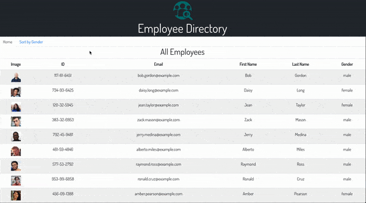

# Employee-Directory
 A React application for employee database sorting
 
 
 
### View deployed application [here](https://rachelhumble.github.io/employee-directory/)


### Description: 
This application pulls employee data via API and demonstrates the ability to view either total employee data or view sorted. The sort function dynamically populates tables of employee data based on user-selected Gender field buttons. It utilizes CSS styling and React props drilling. 

## Technologies Used
React.js, [RandomUser API](https://randomuser.me/)

## User Story
```
As a corporate director
I want to be able to view and sort all employees
So that I can better access employee data
```

## Installation
Git pull and run the following command:
```
npm i
```
## Usage
```
npm run start
```

